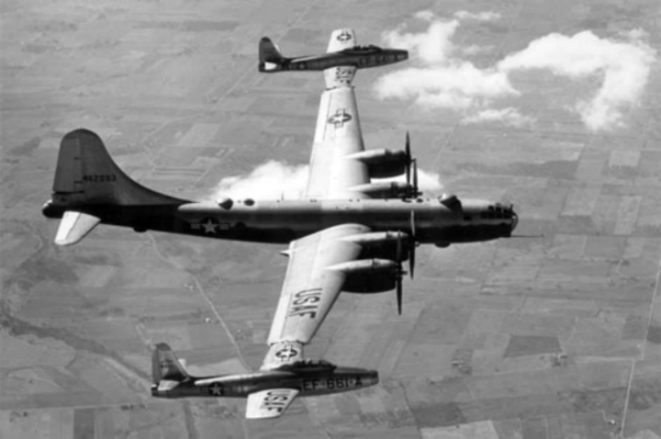
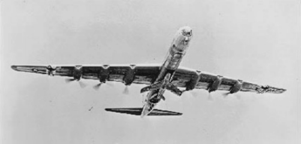

type::  
topic::
source:: 

# [[airship|airship]]:  
- American experiment
		- ![[USS_Akron_releases_its_N2Y_1_aircraft.jpg|301]]
		- ![[USS-Akron-parasite-figher-release.gif|344]]
- British experiment
		- ![[500px-HMA_R_23_Airship_With_Camel_N6814.jpgutm_source=en.wikipedia.jpg|250]]
- didn't work well
	- https://en.wikipedia.org/wiki/23-class_airship#23r
	- https://en.wikipedia.org/wiki/Airborne_aircraft_carrier
# Planes  
- Boeing 747-AAC (Airborne Aircraft Carrier)
		- would carry up to 10 "microfighters"
		- Images
			- ![[Boeing_747_AAC_cutaway.png|Boeing_747_AAC_cutaway.png]]
- Project Tom Tom  
		- 
		- stuck the planes on the wings of the mother plane
- FICON project  
		- 
		- launched the plane from the bomb bay
			- using a trapeze
				- ![[F-84E_FICON.jpg|434x328]]
			- could be caught using trapeze also
		- became obsolete after the [[Lockheed U-2|Lockheed U-2]]