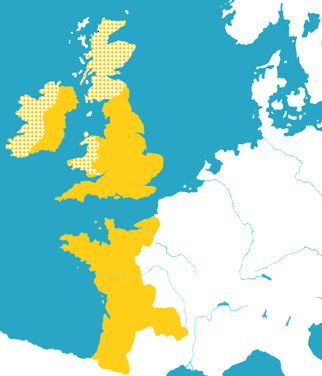

---
tags:
  - topic/history
share: true
---
type::  
topic::
source:: 

- ## Summary:  

  - Possessions of the Angevin Kings of England
    - formed during [[The Anarchy|The Anarchy]]
  - land in British Isles and France (roughly half)
  - 12th to 13th centuries ([[Late middle ages|Late middle ages]] )
  - lead to conflict and rivalry between the kings of France
- ## Rulers:

  - Henry II
  - Richard I
  - John
- ## Land covered by the empire:  

  - All of England
  - half of France (roughly)
  - parts of Ireland and Wales
  - further influence across the remaining British Isles
  - Image of the extent of the angevin empire around 1189
    - 
-
