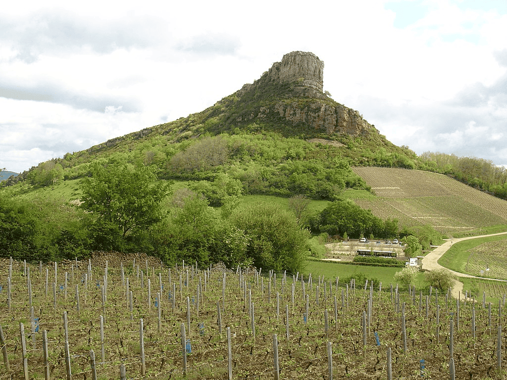

---
tags:
  - topic/geography
  - topic/history
share: true
---
- ## Summary  
	- Limestone escarpment
	-
		- prehistoric site eponymous with [[soletrean|soletrean]] culture
		- used as a hunting site
			- afforded perfect location to develop traps
	- ### Location:
	- ### Image:
	  collapsed:: true
		- 