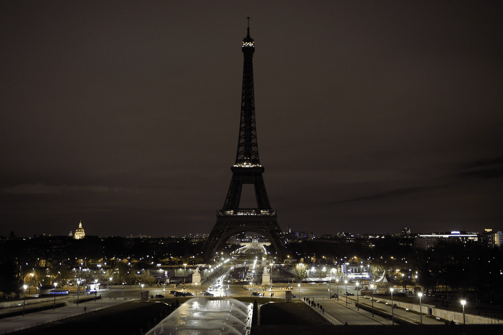

type::  
topic:: #topic/architecture
source:: 

- ### Tribute to the queen:
	- 
- located in [[Paris|Paris]]
- was the centrepiece of the 1889 world's fair  
- is 330m tall!  
- as of 2022 it is the 2nd tallest free standing structure in France, after the [[Millau Viaduct|Millau Viaduct]]  