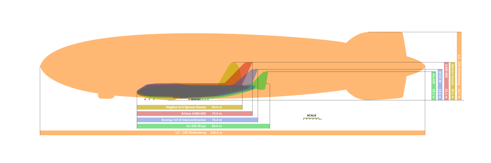

# History of airships  
## Pre-world war
- 1670 - Francesco Lana de Terzi
	- ![[u=https - - - www.oldbookillustrations.com - site - assets - high-res - 1837 - airship-1670-rawscan.jpg|208x247]]
- 1709, priest made a hot air balloon, which ascended to 95m
	- witnessed by
		- King John V of portugal
		- future Pope Innocent XIII
- more practical dirigible later described in 1783
	- 79m long streamlined envelope
	- internal ballonnets that could be used for regulating lift
	- long carriage - can be used as boat in the event of a splashdown
- 1785 the english channel was crossed with a balloon
	- flapping wings for propulsion
	- bird-like tail for steering
	- image:
- 1852 - Giffard's steam powered airship
	- Henri Giffard made first engine-powered flight
		- flew 27 km
		- hydrogen filled
		- image:
- 1872 - Haenlein's airship powered by an internal combustion engine
	- used the coal gas to inflate the envelope
	- image:
- 1883 - first electric powered flight by Tissandier
- 1884 - first fully controllable free flight by Charles Renard, and Arthur Constantin Krebs in the french army airship _La France_
	- 52m long
	- 1,900 m^3
	- 8km in 23 mins
	- electric motor
- 1900 - first Zeppelin flight (LZ1)
	- named after Count von Zeppelin
	- was flawed
	- 
- 1901 Rounding the [[Eiffel Tower|Eiffel Tower]] - Santon-Dumont No.6
	- 
- 1906 LZ2
	- more successful
## WW1
- airships used as bombers
- airships used for scouting
- 
#### German use of airships against britain
- used for long-range bombing
- counteract British naval superiority
- proved to be innacurate
- vulnerable to incendiary and explosive ammunition
	- made of hydrogen
- planes proved more useful
## Inter-war
- British inter-war airships
	- made copies of the German ones
- USS Shenandoah and USS Los Angeles
	- Shenandoah based on Zeppelin
		- the airship USS Shenandoah was filled with helium  
			- Helium was so scarce that the USS shen. contained most of the world's supply!
	- Los Angeles built by the Zeppelin company as part of war reparations
	- around this time the [[Empire State Building|Empire State Building]] was completed with a dirigible mast (never used)
## Hindenburg
- Shattered public confidence in zeppelins
- was **big**
-
## WW2
- Germany had by now determined they were militarily obsolete
- USA used them agains Japanese and German Submarines
- ### Post - War
- used only for:
	- advertising
	- sightseeing
	- surveillance
	- research
	- advocacy
	- TV camera platforms (blimps)
		- eg. goodyear blimps
- Zeppelin company returned to the airship business in 1990's
	- Zeppelin NT