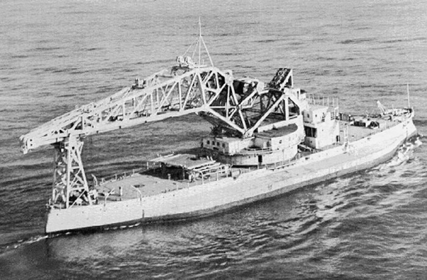

# History: 
## [[Middle ages|medieval]] Europe:
- used for deployment in a whole port basin
- introduced as early as the 14th century
## the Age of Sail
- the "sheer [[hulk|hulk]]" of a [[ship|ship]] was used as a floating crane
- heaviest single component of ships were their main masts
## 20th century
- USS Kearsarge
	- battleship had a 250 ton crane attatched
	- 