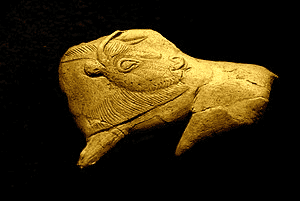
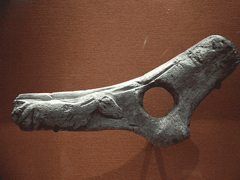
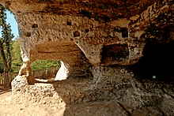
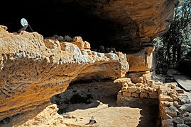
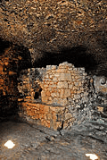
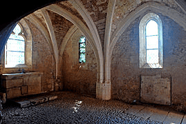
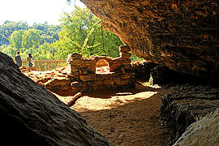

---
tags:
  - topic/history
share: true
---

- a rock shelter under an overhanging cliff near Tursac in the Dordogne in France
- ### Occupied by:
	- [[magdalenian|magdalenian]] culture
	- [[middle ages|middle ages]]
- ### Excavations:
	- #### Art:
		- *Bison licking insect bite*  
			- 
		- *Baton fragment* - with low relief horse  
			- used in the manufacture and throwing of spears
			- hole is a gauge to shape the shaft of the spear
			- It can also be used to straighten both the tips and the shafts.
			- By looping a strip of raw hide through the hole the tool becomes a weapon.
				- Looping the thong around the end of the spear, turns the baton into a spear thrower.
			- The object represents both a decorated tool and weapon; carrying kit that serves more than one function has immediate advantages when one is on the move.
			- 
- ### Images:
	- 
	- 
	- 
	- 
	- 