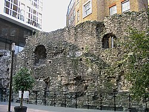

---
tags:
  - topic/history
  - topic/architecture
share: true
---
- ## History :
	- initially built in AD200
	- after the [[Roman Empire|Roman Empire]] departure in 410, the wall fell into disrepair
		- political power on the island spread throughout the [[Heptarchy|Heptarchy]]
	- after William the Conqueror, restorations were undertaken
	- from 18th Century onwards, the expansion of the CoL saw large parts of the wall demolished
	- largely no longer exists
- ## Images
	- 
	- 
		- bastion 12 in the barbican estate
	- ![[Pasted image 20230217090550.png|Pasted image 20230217090550.png]]
		- tower hill gardens
	- ![[Site_of_St_Alphage,_London_Wall_-_geograph.org.uk_-_643181.jpg|289]]
		- St Alphage Garden
		- the brick turrets are of [[Middle ages|medieval]] origin