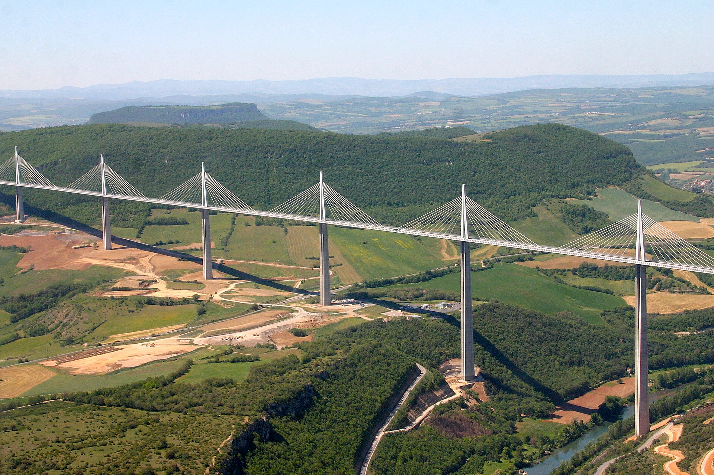
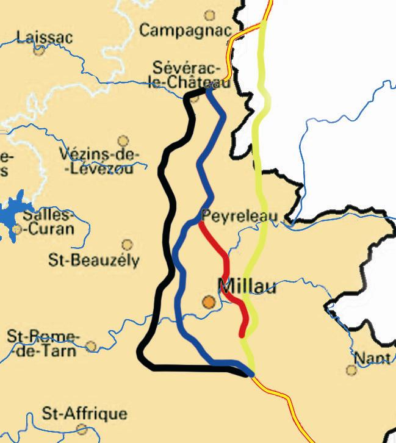

type:  
topic: #topic/architecture
source: 
# summary
- tallest freestanding structure in France, followed by the [[Eiffel tower|Eiffel tower]] in [[Paris|Paris]]
## image:
- 
# Fast Facts:  
- designed by Norman Foster (english)
- as of 9th Sep 2022, it is the tallest [[bridge|bridge]] in the world
- Daniel has been on it!
# There were 4 main possible routes when it was planned
- 