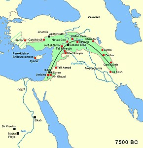
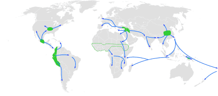

---
tags:
  - topic/history
share: true
---
- # Summary:
	- Final division of the **stone age**
	- ### included the:
		- introduction of farming
		- domestication of animals
		- settlement
	- ### Dates: (different for different parts of the world)
		- Began 12,000 [[BP|BP]] (roughly)
		- ended 6,500 [[BP|BP]] (4,500 BC)
			- transitional period of the Chalcolithic (Copper Age)
				- development of metallurgy
		- Some parts of the world remained broadly comparable to the neolithic stage until first contact  
			- Oceania
			- some regions of the americas
- # Neolithic Revolution  
	- > **From Hunter-Gathering to Agriculture**
	- Began in the [[Levant|Levant]]
		- 
	- made increasingly large population possible
	- Permanent settlements
	- ### Effects on Population:  
		- did **not** rise for a few millennia after the revolution!!
		- benefits offset by diseases and warfare
	- ### Approximate Centres of origin of agriculture  
		- 
	- ## Theories as to what drove populations to take up agriculture  
		- ### Oasis Theory
			- Climate got drier due to Atlantic depressions shifting northwards
			- communities contracted to oases
			- means they were forced into close association with animals
				- which they domesticated
			- planting of seeds
			- **Theory has little support**
				- evidence suggests that the region was getting wetter, not drier
		- ### Hilly Flanks hypothesis
			- Agriculture began in the hilly flanks of Taurus and Zagros mountains
				- climate was not drier
					- contrary to oasis theory
				- land more fertile
		- ### Feasting Model
			- agriculture driven by ostentatious displays of power
				- feast = dominance
		- ### Demographic theories
			- increasingly sedentary population
				- required more food than could be gathered
		- ### Evolutionary theory
			- agriculture was an _evolutionary adaptation **of plants**_
- #