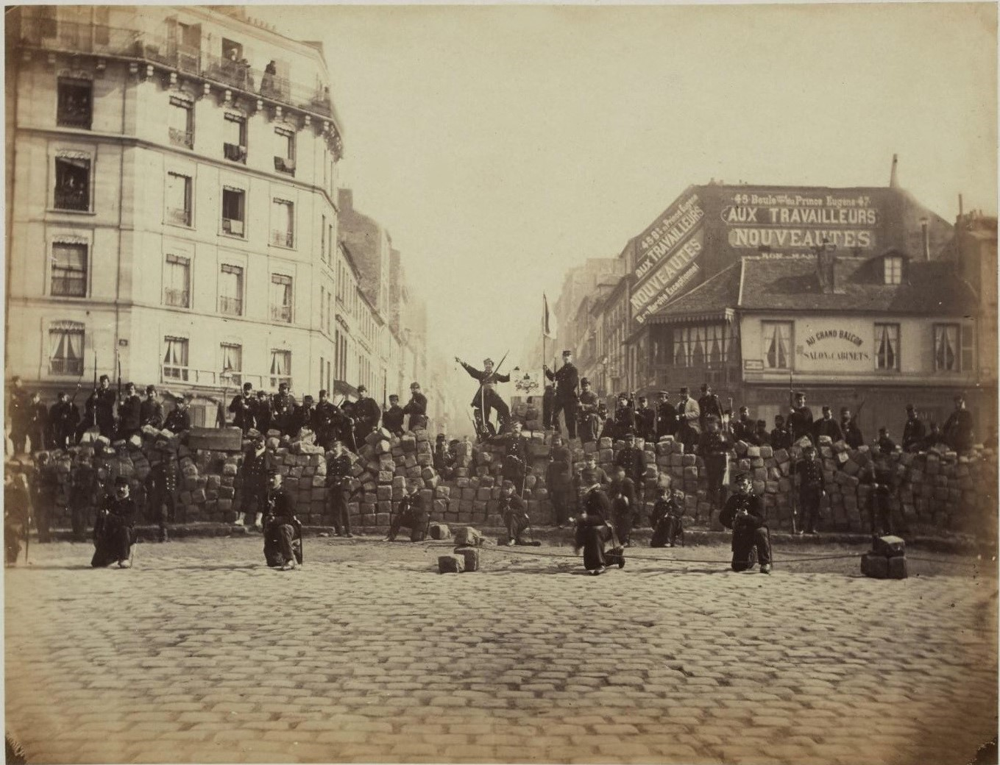

---
tags:
  - topic/history
share: true
---
- ## Summary:  
	- following the [[seige of Paris|seige of Paris]], a revolutionary government seized control of [[Paris|Paris]]
	- from 18th March to 28th May
	- ### Policies:
		- progressive
		- anti-religious social democracy
		- self-policing
		- remission of rent
		- abolition of child labour
		- right of employees to take over an enterprise deserted by its owner
	- ## Ending
		- two months later, the French army suppressed the commune during ("The bloody week")
		- national forces...
			- killed between 10,000 to 20,000 communards
			- took 43,522 communards prisoner
				- including 1,054 women
	- debates on the policies of the commune had significant influence on the ideas of Karl Marx
- 