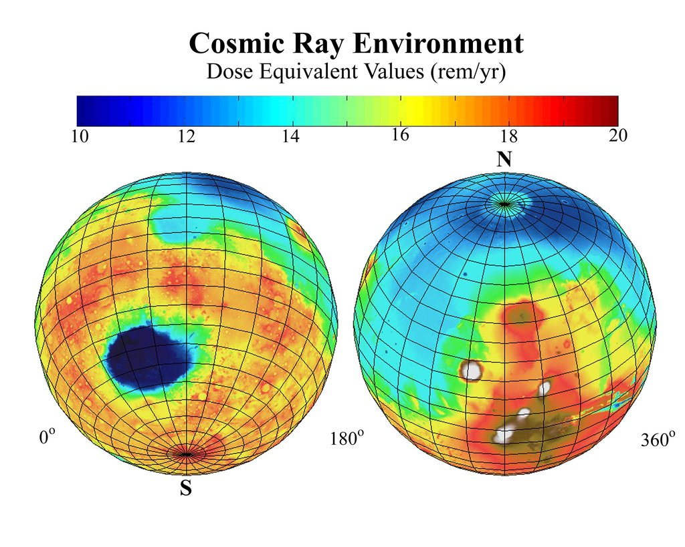

## Radiation
[[Sources#MentalFlossMars|Sources > MentalFlossMars]]
- MARIE (Mars radiation environment experiment), was a probe sent to surface of mars by NASA in 2001 to study planet's radiation.
	- Found Mars has $2\frac{1}{2}$the amount of radiation on ISS
- Earth has a magnetosphere, mars does not
- can cause cancer
[[Sources#MarspediaRadiation|Sources > MarspediaRadiation]]
- avg exposure on Earth due to natural sources is 6.2 mSv/yr
- avg Mars exposure on Mars is 240-300 mSv/yr
- 50 x more
[[Sources#radiation deep space nasa|Sources > radiation deep space nasa]]
- 2 types
	- solar
	- GCR
		- more ionising

### Radiation Map
[[Sources#JPL_radiation|Sources > JPL_radiation]]
 
- shows radiation data from NASA's Mars 2001 Odyssey
- lowest radiation found where elevation is lowest
	- Thicker atmosphere
- For context, ISS radiation typically 20 - 40 rems (1rem = 0.01 sieverts)

### Human limits
[[Sources#MarspediaRadiation|Sources > MarspediaRadiation]]
- can cause radiation sickness and cancer
- International Commission on Radiation Protection recommends that max radiation limited to 50 mSv/yr
 #### Ramsar, Iran
- Highest natural exposure on earth is 260mSv/yr (around Mars levels) in Ramsar, Iran, where people have been living for generations with no reported harmful effects.
- people living in Ramsar showed increased immunity to [[Gamma|Gamma]] ray exposure
	- whether from evolutionary adaption or immune system being exercised regularly is not known.

## Solutions to radiation
[[Sources#radiation deep space nasa|Sources > radiation deep space nasa]]
- two main ways of shielding from radiation:
	- ### Add more stuff
		- whereby the sheer volume of material surrounding the structure would absorb the energetic particles
		- expensive to launch
	- ### Use more efficient shielding materials
		- Cut down on weight and cost
		- "best way to stop particle radiation is by running that energetic particle into something that's a similar size"