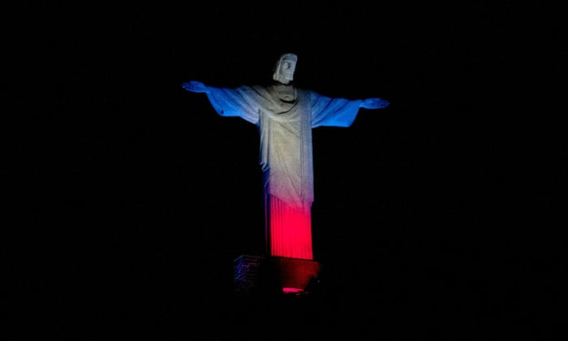
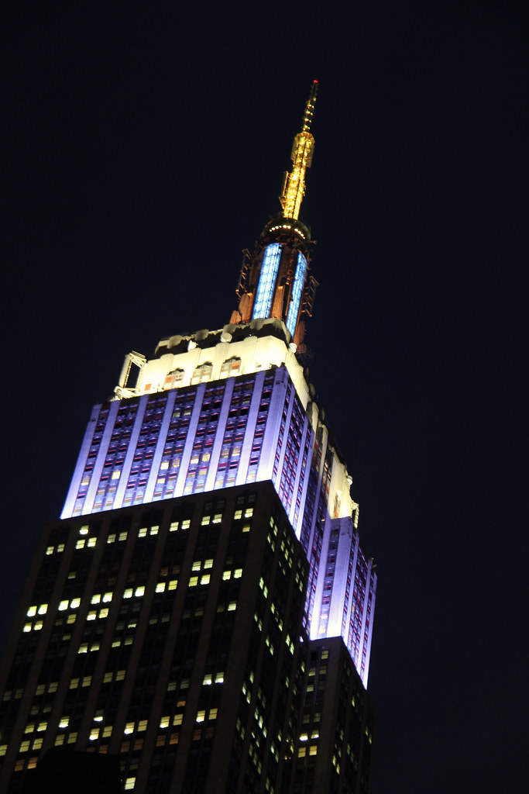

---
tags:
  - topic/history
share: true
---

## Tributes to the queen (after her death)
### Quotes
#### Domestic 
>*"In the difficult days ahead we will come together with our friends across the United Kingdom, the Commonwealth and the world to celebrate her extraordinary lifetime of service."* 
> - Liz Truss, PM

>"As we grieve together, we know that, in losing our beloved Queen, we have lost the person whose steadfast loyalty, service and humility has helped us make sense of who we are."
> - Justin Welby, Archbishop of Canterbury

#### International
>"She charmed us with her wit, moved us with her kindness, and generously shared with us her wisdom. She stood in solidarity with the United States during our darkest days after 9/11, when she poignantly reminded us that, 'Grief is the price we pay for love'."
> - Joe Biden President of the USA

>"Her Majesty Queen Elizabeth II embodied the British nation's continuity and unity for over 70 years. I remember her as a friend of France, a kind-hearted queen who has left a lasting impression on her country and her century."_
> - Emmanuel Macron, President of France

> *"She will be missed, not least her wonderful humour."*
> - Olaf Scholz, German Chancellor

> _"She was a constant presence in our lives – and her service to Canadians will forever remain an important part of our country's history. I will miss her so."_
>  -Justin Trudeau, Canadian Prime Minister

>"The world will long remember her devotion and leadership."_
> - UN Secretary General Antonio Guterres

>"On behalf of the people, we extend sincere condolences to the Royal Family, the entire United Kingdom and the Commonwealth over this irreparable loss. Our thoughts and prayers are with you."_
> - Volodymyr Zelensky, Ukraine's President

>"Over more than 70 years, she exemplified selfless leadership and public service. My deepest condolences to the Royal Family, to our Nato allies the United Kingdom and Canada, and to the people of the Commonwealth."_
>- NATO Secreatry General Jens Stoltenberg

>I willingly join all who mourn her loss in praying for the late Queen’s eternal rest, and in paying tribute to her life of unstinting service to the good of the nation and the Commonwealth, her example of devotion to duty, her steadfast witness of faith in Jesus Christ and her firm hope in his promises."
> - Pope Francis

>“Xi Jinping, representing the Chinese government and the Chinese people, as well as in his own name, expresses deep condolences,”_
> - Xi Jingping, premier of China
#### Other trbutes
- Japanese PM
- Hillary CLinton
- Australian PM
- putin??
- alot alot more

### Gestures 
- UK flags at half mast
- US flags at half mast
- Solomon islands flags at half mast
- [[Eiffel tower|Eiffel tower]] went dark (wasn't lit up at night)
	- 
- [[Christ the redeemer|Christ the redeemer]] lit up in Great British flag colours
	- 
- [[Empire State Building|Empire State Building]] lit up in purple and silver
	- {:height 345, :width 225}

this is a typg test