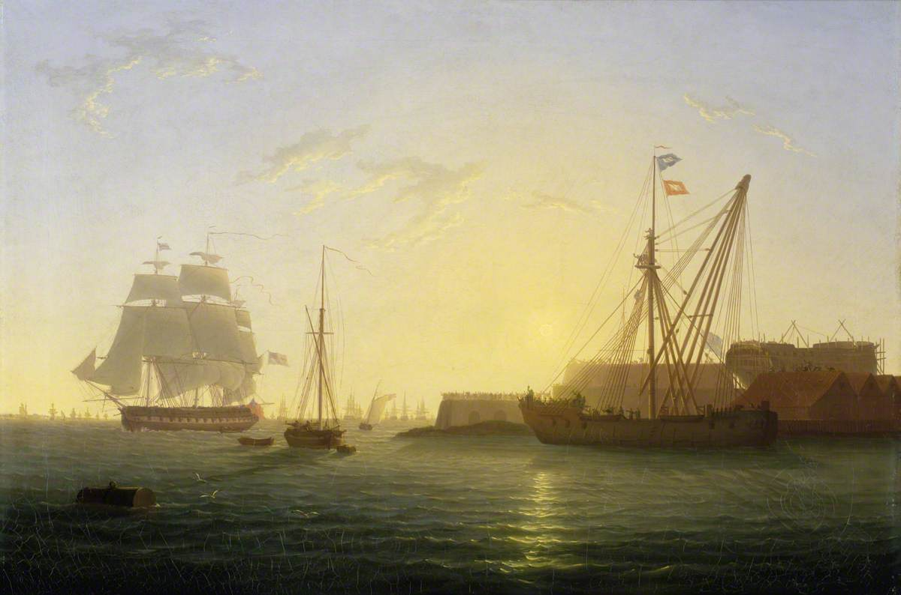

type::  
source:: 
topic:: #topic/vehicle

# Summary
- a hulk is a [[ship|ship]] that is afloat, but incapable of going into sea
	- ![[Lebreton_engraving-09-hulk.jpg|296]]
	
# Types
## Sheer Hulk  
- used in shipbuilding and repair as a floating crane
- used to place the lower masts of a [[ship|ship]]
- originated in the royal navy in the 1690's
- mostly decommissioned warships
- ### Image:
	- {:height 254, :width 404}
## Receiving Hulk  
- used in harbour to house newly recruited sailors before they are assigned to a [[ship|ship]]
- due to the practice of [[impressment|impressment]] , receiving hulks prevented escape from unwilling recruits
- often also served as hospitals
- ![[Garneray_-_Portsmouth_Harbour_with_Prison_Hulks.jpg|Garneray_-_Portsmouth_Harbour_with_Prison_Hulks.jpg]]
## Modern day uses
- FPSO units (floating production storage and offloading)  
		- largest oil tankers have been converted
		- eg.	- [[Knock Nevis|Knock Nevis]]
				- largest [[ship|ship]] ever built
				- 2 of the 3 TI-class supertankers (then the largest ever built ships)