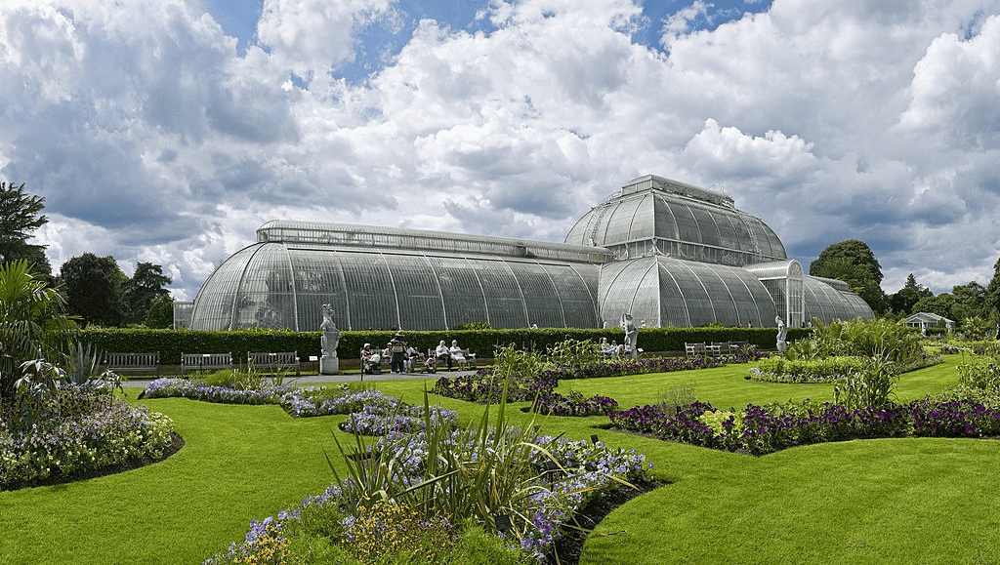
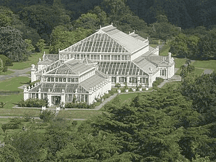
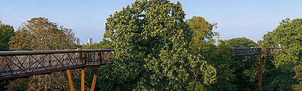
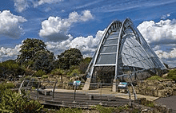
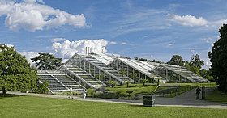

---
tags:
  - topic/biology
share: true
---
## Summary:
- botanic garden in south west [London](London.md)
> has the "largest and most divers botanical and mycological collections in the world"
- founded in 1840
- >8.5 million preserved plant and fungal specimens
### Images:
- 
- 
- 
- 
- 
- has it's own police force [[kew constabulary|kew constabulary]]