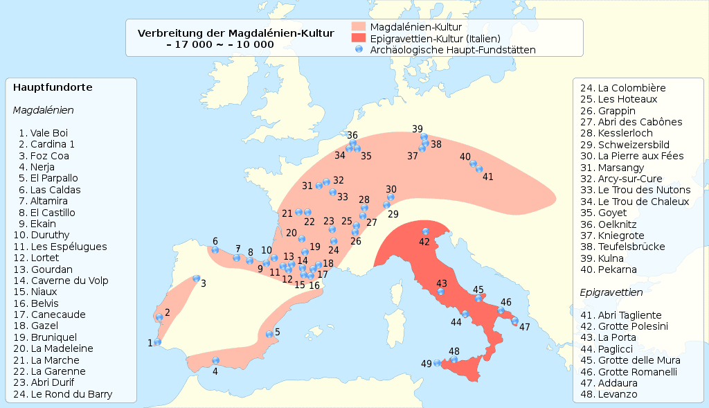

---
tags:
  - topic/history
share: true
---
- ## Summary of Magdelenian
	- Upper [[Palaeolithic|Palaeolithic]] cultures
	- cultures in western Europe
	- named after the site of [[La Madelaine|La Madelaine]]
	- ### Date:
		- 17,000 to 12,000 years ago
	- ### Location:  
		- 