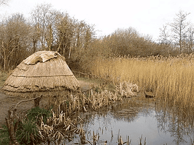

---
tags:
  - topic/history
share: true
---
- ## Summary
	- preceded the [[Neolithic|Neolithic]] age
	- Final period of hunter-gatherer cultures in Europe
	- between Last Glacial Maximum and [[Neolithic|Neolithic]] revolution
	- ### Time span:
		- 15,000 to 5,000 [[BP|BP]] in europe
		- 20,000 to 10,000 [[BP|BP]] in SW asia
	- ### Image:
		- reconstruction of a "temporary mesolithic house"
			- 
			-