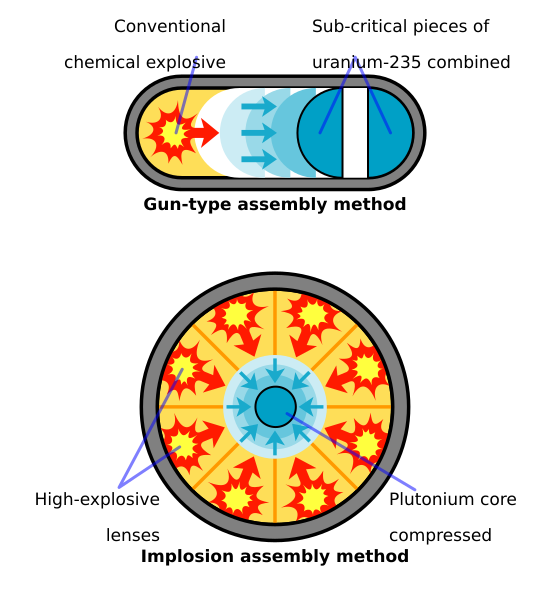

---
aliases:
  - nuclear weapon
  - nuclear missile
  - atomic bomb
tags:
  - topic/physics
share: true
---
# Types:
- Fission bomb
- Fusion bomb (a.k.a thermonuclear bomb)
# Fission weapons
- 

# Fusion weapons 
- 

- uses fission to trigger fusion
# Effects:
- [[nuclear winter|nuclear winter]]
- 

