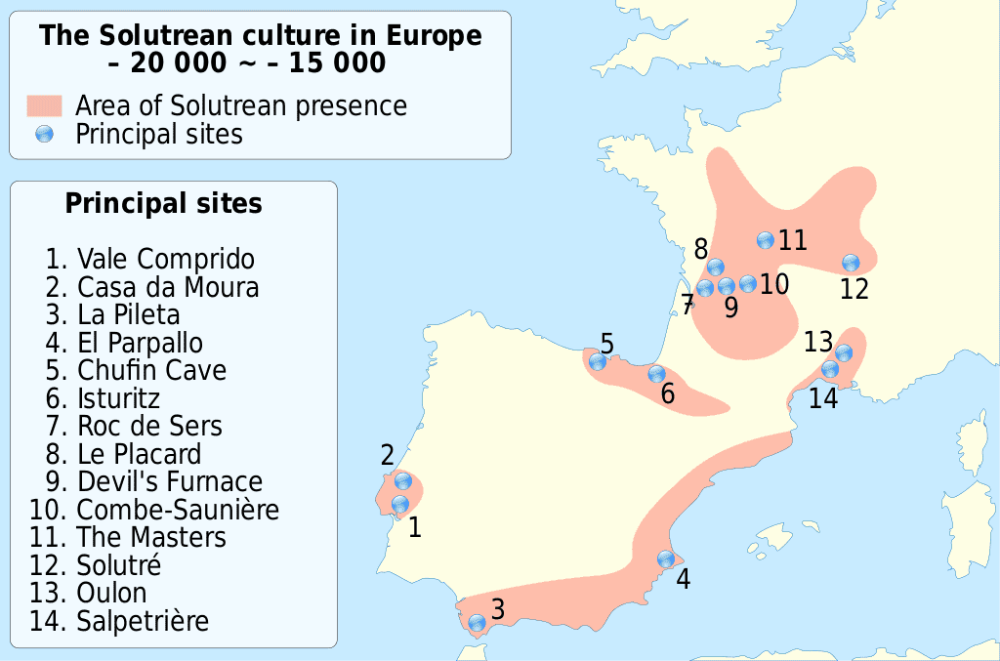

---
tags:
  - topic/history
share: true
---
- ## Summary  
	- relatively advanced flint tool-making style of the Upper [[Palaeolithic|Palaeolithic]]
	- name comes from the site of "[[Cros Du Charnier|Cros Du Charnier]]", located in Solutré, in France
	- ### Dates:
		- 22,000 to 17,000 [[BP|BP]]
	- ### Location:
		- {:height 221, :width 302}