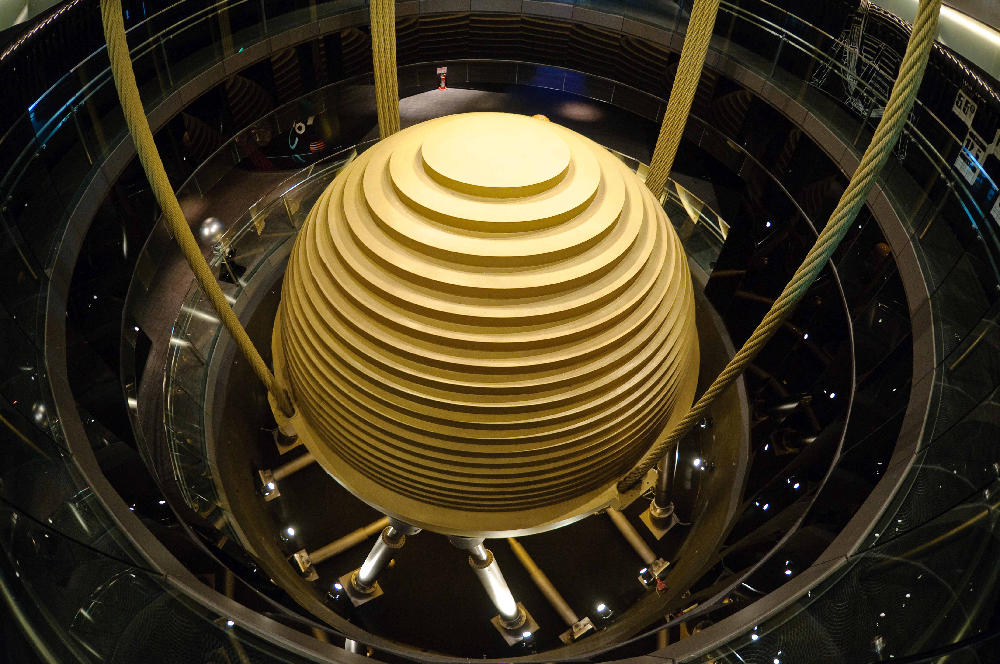
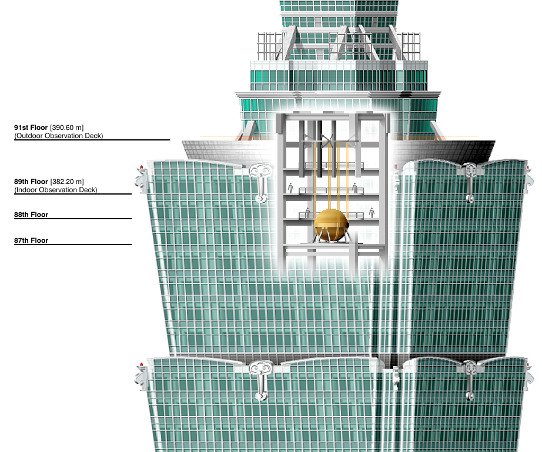

---
tags:
  - topic/architecture
share: true
---
 
- as of [[23rd Sep 2022|23rd Sep 2022]], tallest building in Taiwan
- constructed between 1999 and 2005

| Height        |                    |
| ------------- | ------------------ |
| Architectural | 508.2 m (1,667 ft) |
| Tip           | 508.2 m (1,667 ft) |
| Roof          | 449.2 m (1,474 ft) |
| Top floor     | 438.0 m (1,437 ft) |
| Observatory   | 449.2 m (1,474 ft) |

- ## Records  
	- was the tallest from 2004 to 2009 (101 floors)
		- overtaken by [[Burj Khalifa|Burj Khalifa]]
	- it had the fastest lifts
		- 60.6 km/h
		- 37.7 mph
- ## Design
	- 14% [[vanity height|vanity height]]
	- ### built to withstand:
		- tropical storms
			- gale force 60 m/s (134 mph, 216 km/h)
		- earthquakes
			- strongest earthquakes in a 2,500 yr cycle
	- mimics bamboo?
	- ### Damper:
		- {:height 184, :width 258}
		-
		- 
		- [[tuned mass damper|tuned mass damper]]
	-