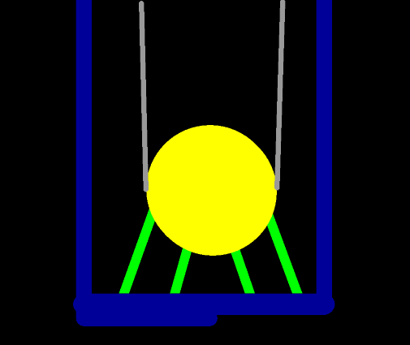
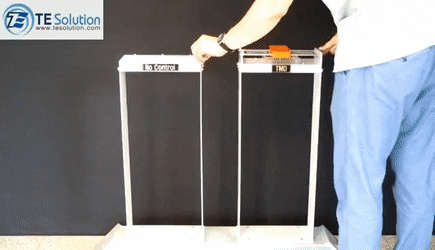
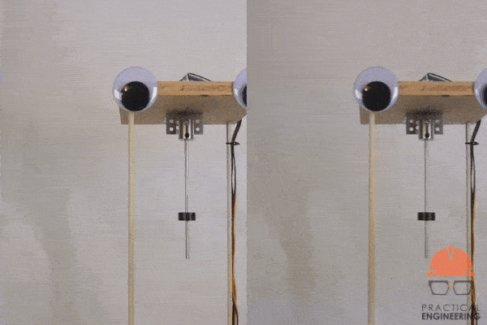
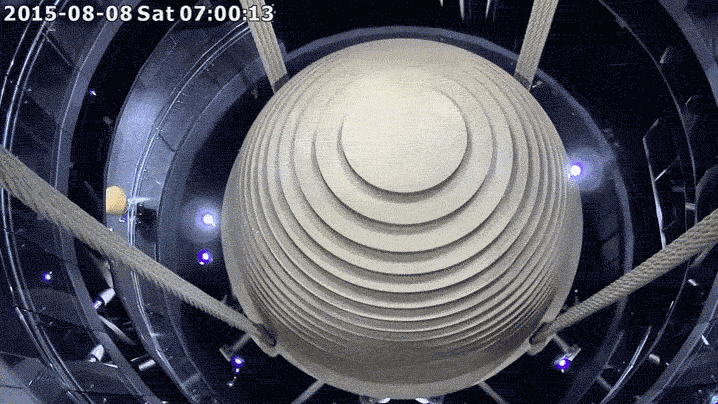

---
tags:
  - topic/physics
share: true
---
- 
- a.k.a harmonic absorber
- ## how does it work?
	- reduces mechanical vibrations
	- 
	- ### without vs with
		- 
		- 
	-
- ## in action: ([[taipei101|taipei101]])
	- 